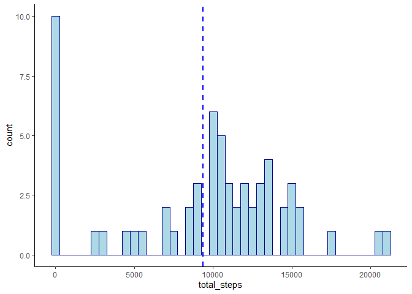
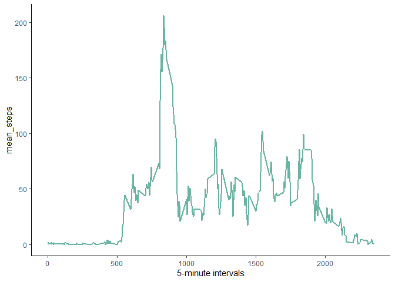
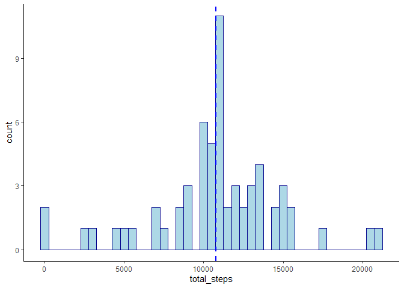
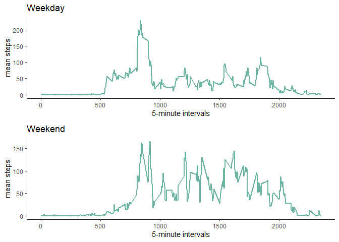

### Reproducible Research: Assignment 1


Loading required libraries and data.


```r
suppressPackageStartupMessages(library(ggplot2))
suppressPackageStartupMessages(library(dplyr))
require(gridExtra)
```

```
## Warning: package 'gridExtra' was built under R version 4.0.5
```

```r
data = read.csv("activity.csv")
```
  

#### What is mean total number of steps taken per day?


Calculating the total number of steps per day and plotting the frequency of steps in a histogram. 


```r
tot_dat <- data %>%
  group_by(date) %>%
  summarise(total_steps = sum(steps, na.rm = T))

ggplot(tot_dat, aes(x=total_steps)) + 
  geom_histogram(color="darkblue", fill="lightblue", binwidth=500) + 
  geom_vline(aes(xintercept=mean(total_steps)), color="blue", linetype="dashed", size=1) +
  theme_classic()
```

<!-- -->


```r
mean_steps <- round(mean(tot_dat$total_steps), 2)
med_steps <- median(tot_dat$total_steps)
```

The mean daily steps are: 9354.23  
And the median daily steps are: 10395


#### What is the average daily activity pattern?


Claculating the mean steps per 5-minute interval and plotting the time series.


```r
mean_dat <- data %>%
  group_by(interval) %>%
  summarise(mean_steps = mean(steps, na.rm = T))
```

```
## `summarise()` ungrouping output (override with `.groups` argument)
```

```r
ggplot(mean_dat, aes(x=interval, y=mean_steps)) +
  geom_line(color="#69b3a2", size = 1) + 
  xlab("5-minute intervals") +
  theme_classic()
```

<!-- -->

```r
max_steps <- round(max(mean_dat$mean_steps), 2)
max_int <- mean_dat[which.max(mean_dat$mean_steps),]$interval
```

The maximum steps in an interval is 206.17 and occurs at 835 minutes.  


#### Imputing missing values

Replacing the missing data with the mean steps for the 5-minute interval and plotting as a histogram.


```r
sum_na <- sum(is.na(data))

new_dat <- merge(data, mean_dat, by = 'interval')

new_dat$steps <- ifelse(is.na(new_dat$steps), round(new_dat$mean_steps, 0), new_dat$steps)

new_dat <- new_dat[,c(2,3,1)]

tot_dat_new <- new_dat %>%
  group_by(date) %>%
  summarise(total_steps = sum(steps, na.rm = T))
```

```
## `summarise()` ungrouping output (override with `.groups` argument)
```

```r
ggplot(tot_dat_new, aes(x=total_steps)) + 
  geom_histogram(color="darkblue", fill="lightblue", binwidth=500) + 
  geom_vline(aes(xintercept=mean(total_steps)), color="blue", linetype="dashed", size=1) +
  theme_classic()
```

<!-- -->

```r
mean_steps_new <- as.character(round(mean(tot_dat_new$total_steps), 0))
med_steps_new <- as.character(round(median(tot_dat_new$total_steps), 0))
```

Total number of missing values in the original dataset: 2304  

We can see that on imputing the data, the average total steps has increased to 10766 and the median has increased to 10762.

#### Are there differences in activity patterns between weekdays and weekends?

Adding a new flag to differentiate between weekends and weekdays and plotting them separately.


```r
new_dat$day <- ifelse(weekdays(as.Date(new_dat$date)) %in% c('Saturday', 'Sunday'), 
                      'weekend', 'weekday')

mean_dat_new <- new_dat %>%
  group_by(interval, day) %>%
  summarise(mean_steps = mean(steps, na.rm = T))
```

```
## `summarise()` regrouping output by 'interval' (override with `.groups` argument)
```

```r
p1 <- ggplot(mean_dat_new[mean_dat_new$day == 'weekday',], aes(x=interval, y=mean_steps)) +
  geom_line(color="#69b3a2", size = 1) + 
  labs(title = 'Weekday', x = "5-minute intervals", y = "mean steps") +
  theme_classic()

p2 <- ggplot(mean_dat_new[mean_dat_new$day == 'weekend',], aes(x=interval, y=mean_steps)) +
  geom_line(color="#69b3a2", size = 1) + 
  labs(title = 'Weekend', x = "5-minute intervals", y = "mean steps") +
  theme_classic()

grid.arrange(p1, p2, ncol=1)
```

<!-- -->

We can see that activity follows a different trend on the weekends, with single interval steps being higher on weekdays but average interval steps being higher on weekends.
